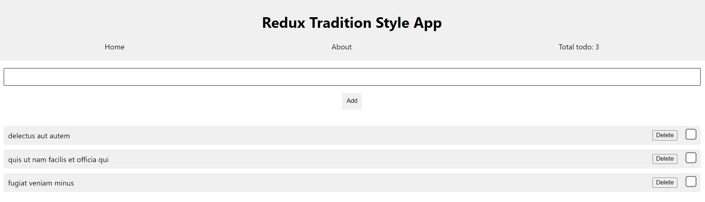

# Learn redux traditional style through todo app

Live: [**https://redux-traditional-style.netlify.app**](https://redux-traditional-style.netlify.app)

## Environment

- Node 19.1.0

## Technologies Used

- react 18.2.x
- redux 4.2.x
- react-redux 8.0.x
